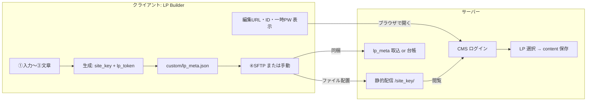
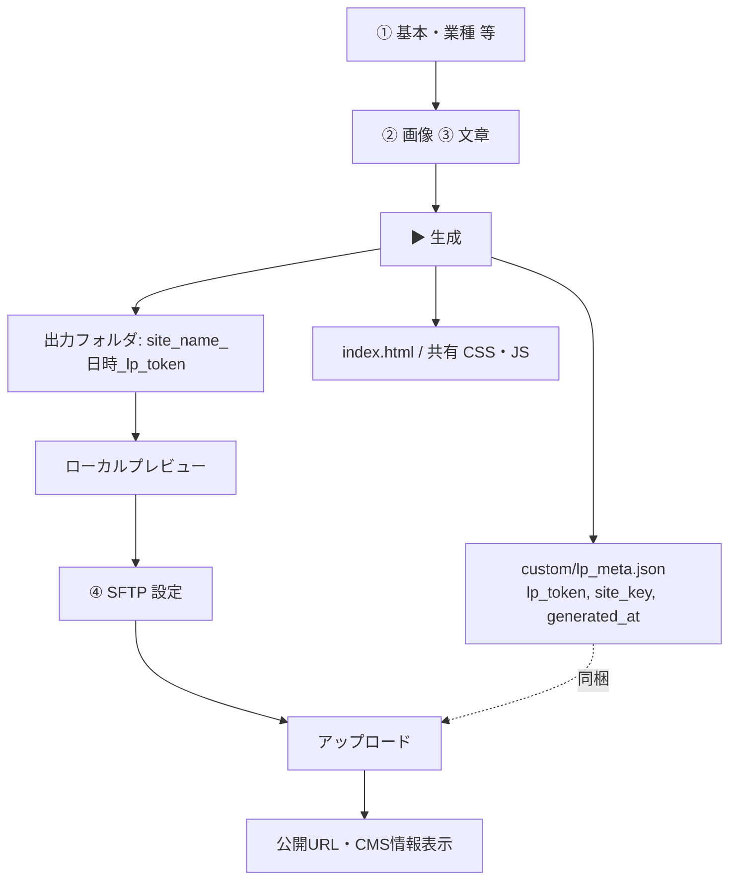
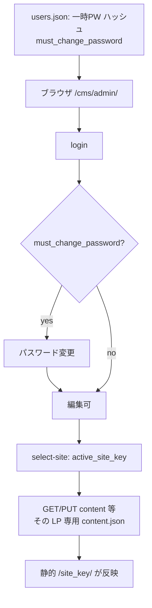
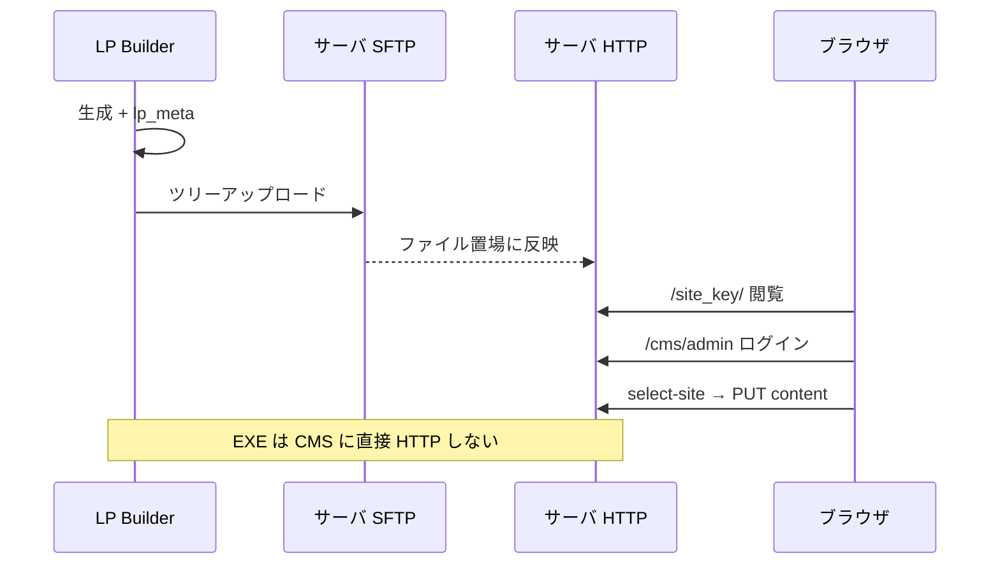

# クライアントアプリ ↔ サーバー — フロー可視化

LP Builder（Windows）と PHP サーバ（`jitan.app` 想定）の役割と接点。  
**実装詳細**は `SERVER_SETUP.md` / `SERVER_CMS_SITE_SCOPING.md` / `lp_builder/README.md`。

---

## 全体像（片道）

---

## クライアント（LP Builder）内フロー

**サーバー非依存:** ①〜⑦設定・コストはローカル完結。生成と SFTP 以外に HTTP 必須なし。

---

## サーバー側フロー（初回オペ＋日常編集）

**前提:** マルチ LP 時は `SERVER_CMS_SITE_SCOPING.md` どおり、台帳＋ `allowed_site_keys` ＋セッションの `active_site_key`。

---

## 両者の「接点」（データの行き方）

| 接点 | 方向 | 中身 |
|------|------|------|
| **SFTP** | Client → Server | ディレクトリ全体。`…/<site_key>/` 以下に `index.html`, `custom/lp_meta.json` 等 |
| **HTTPS 静的** | Server → 閲覧者 | `https://<host>/<site_key>/index.html` |
| **HTTPS CMS** | ブラウザ ↔ Server | ログイン・`select-site`・`content.php`。クライアント EXE とは別経路（人がブラウザ） |
| **識別子** | 生成時にクライアントが決定 | `site_key` = フォルダ名。`lp_token` = `lp_meta.json`（サーバー台帳と突合可） |
| **認証** | サーバーの正 | ログイン ID/PW は `users.json`（LP Builder 表示欄は手元メモ。同期は人間 or 将来 API） |

---

## 一言まとめ

- **クライアント**は「作る・上げる・手取り情報を出す」。
- **サーバー**は「配信する・誰がどの LP を編集するか決めて save する」。
- ファイルの**同一性**は `site_key` / `lp_meta`、**人の操作**はブラウザ CMS 経由。
