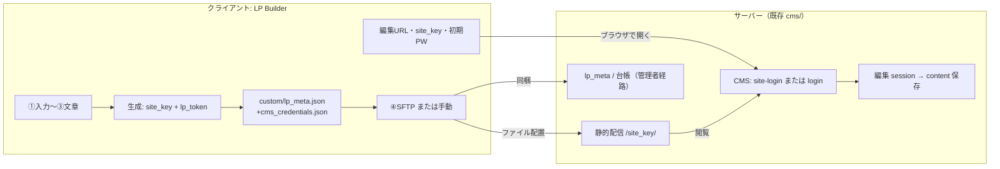
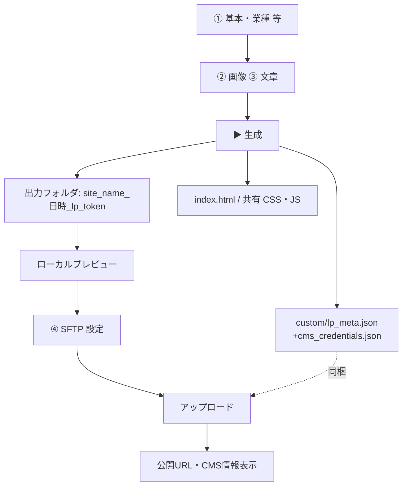
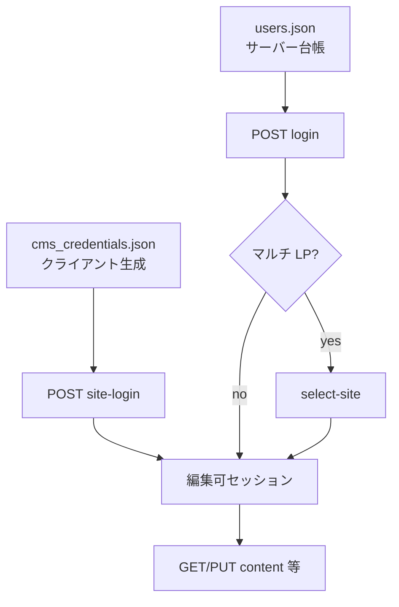
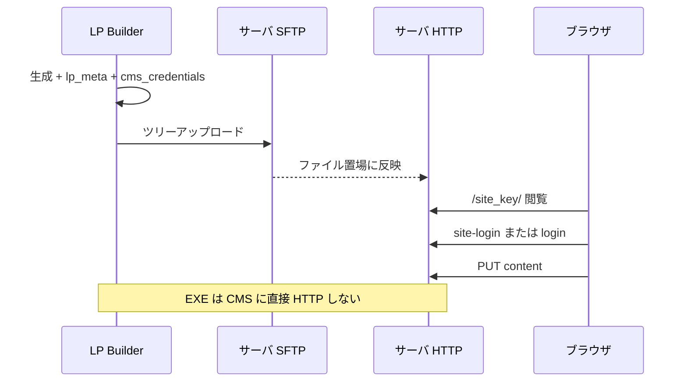

# クライアントアプリ ↔ サーバー — フロー可視化

LP Builder（Windows）と PHP サーバ（`jitan.app` 想定）の役割と接点。  
**仕様の正はクライアントが生成するファイル**（`lp_meta.json`・`cms_credentials.json`）と **`lp_builder/`** 実装。**実装詳細**は `SERVER_SETUP.md` / `SERVER_CMS_SITE_SCOPING.md` / `lp_builder/README.md`。  
ドキュメントルートには **`cms/` が既にある**前提（新規作成手順の話ではない）。

---

## 全体像（片道）

---

## クライアント（LP Builder）内フロー

**サーバー非依存:** ①〜⑦設定・コストはローカル完結。生成と SFTP 以外に HTTP 必須なし。

---

## サーバー側フロー（認証の分岐）

**経路 A（LP 編集者）:** ブラウザで **`POST site-login.php`**（`site_key` + パスワード）→ `cms_credentials.json` 検証 → `must_change_password` なら変更 → `content` 編集。

**経路 B（管理者）:** **`users.json`** + **`login.php`** →（マルチ LP なら）**`select-site`** → `content` 編集。

---

## 両者の「接点」（データの行き方）

| 接点 | 方向 | 中身 |
|------|------|------|
| **SFTP** | Client → Server | ディレクトリ全体。`…/<site_key>/` 以下に `index.html`, `custom/lp_meta.json`, **`custom/cms_credentials.json`** 等 |
| **HTTPS 静的** | Server → 閲覧者 | `https://<host>/<site_key>/index.html` |
| **HTTPS CMS** | ブラウザ ↔ Server | **A:** `site-login` → content。**B:** `login` → `select-site` → content。EXE は CMS に直接 HTTP しない |
| **識別子** | 生成時にクライアントが決定 | `site_key` = フォルダ名。`lp_token` = `lp_meta.json` |
| **認証の正（A）** | **LP ディレクトリ内** | `cms_credentials.json`（ハッシュ）と `site_key`／`lp_token` の整合 |
| **認証の正（B）** | サーバー | `users.json` + 台帳・`allowed_site_keys` |

---

## 一言まとめ

- **クライアント**は「作る・資格情報を同梱する・上げる・手取り情報を出す」。
- **サーバー**は「既存の `cms/` で配信する・認証して save する」。**LP 編集者の ID は `users.json` に増やさず**、ディレクトリ内ファイルで検証する。
- ファイルの**同一性**は `site_key` / `lp_meta` / **`cms_credentials`**、**人の操作**はブラウザ CMS 経由。
